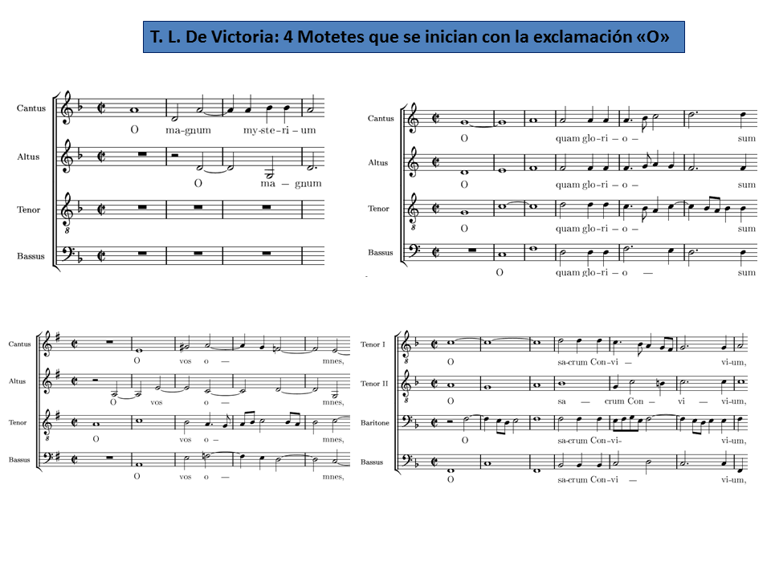
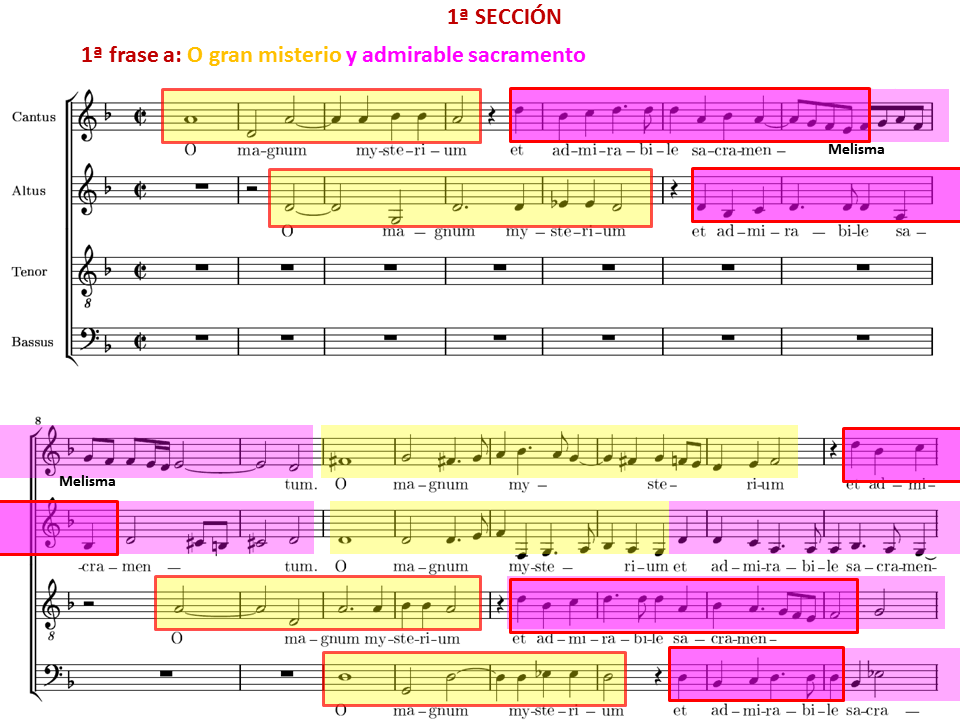
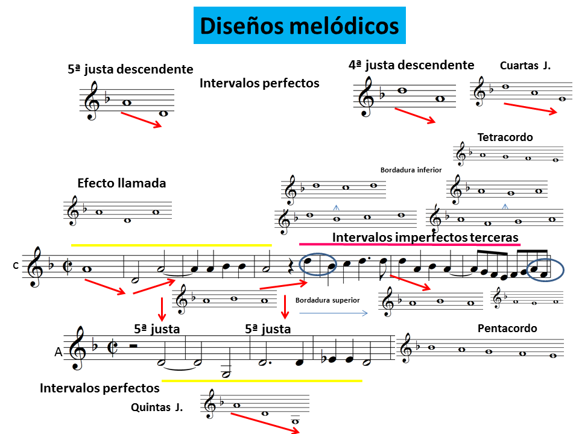
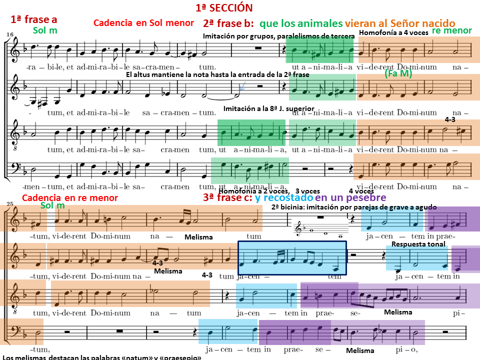
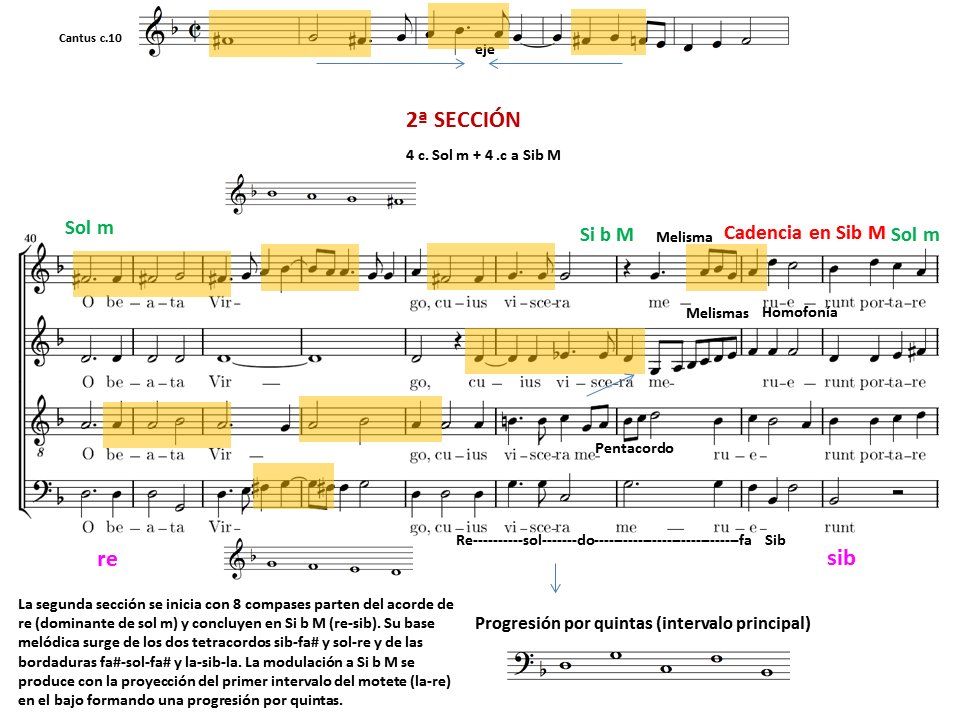
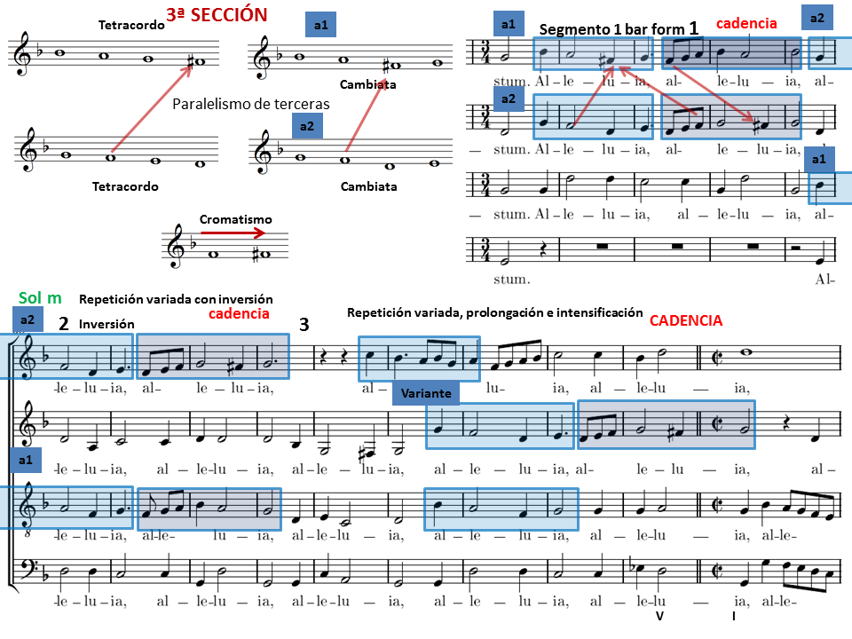
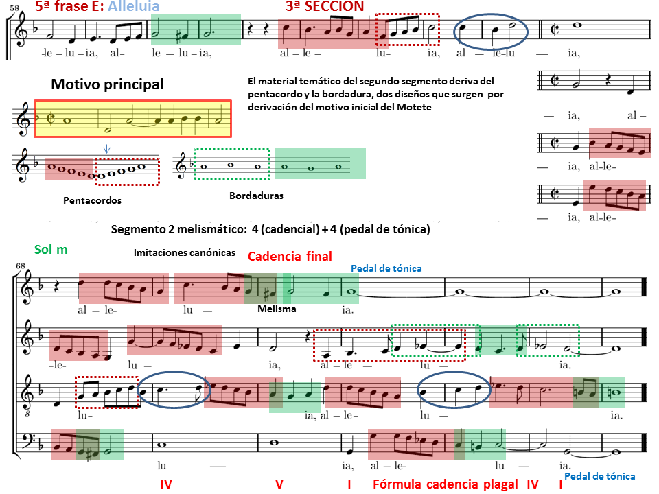

# Introducción

Estos apuntes están basados en el blog <https://musicnetmaterials.wordpress.com/contenido/>. Queremos agradecer a sus autores el haber puesto a disposición de la comunidad educativa unos documentos tan valiosos.

- Los análisis son de **Tomás Gilabert**, *profesor de análisis del Cocopy ebook.epub ebook.zipnservatorio superior de Valencia*
- los apuntes de armonía de **Maria Jesús Moreno**
- las piezas para piano a 4 manos de **Luis Navarro Valcercel**.

## El motete en la época de Victoria

Victoria sigue las características del motete renacentista que se establecen a partir de la generación de Josquin. Hacia 1450, aproximadamente, la politextualidad y las complejidades desarrolladas durante la Edad Media desaparecen  y el motete se convierte en una pieza polifónica compuesta a partir de un texto de origen religioso escrito en latín que no pertenece al Ordinario de la Misa (la mayoría de los textos son  tomados directamente de la Biblia).

La estética renacentista, influida por el pensamiento humanista, establece una relación más estrecha entre música y texto. El compositor crea una estructura original dividiendo el texto en un número concreto de frases y dependiendo del significado de cada una de ellas asigna una textura y una melodía concreta para cada frase, abandonando así las estructuras y melodías preestablecidas.

### Otras características influyentes

Otras características que aparecen hacia 1450 y que influyen en el desarrollo del motete son:

- Las escritura a 4 voces como norma.
- Igualdad de las voces: todas las voces participan por igual en la exposición del material temático abandonando la diferenciación rítmica y la jerarquía de la textura medieval.
- La imitación ya no es una práctica aislada y se establece como  técnica con importancia estructural.
- La polifonía para solistas de la edad media se sustituye por la composición coral en la cual dos o más personas cantan la misma voz.
- A partir de principios del siglo XV se admite la tercera y sexta como consonancia y se produce un control métrico de la disonancia con el cual surgen los retardos, las notas de paso y las bordaduras.

# Capítulo
## O Magnum Mysterium
El compositor T. L. de Victoria (1548-1611), considerado como el  compositor español más destacado del Renacimiento musical tardío, compuso gran cantidad de música polifónica de contenido religioso (misas, motetes, etc.). Su motete  O Magnum Mysterium, para coro mixto a 4 voces, fue publicado en Venecia en 1772. El texto trata un tema navideño (In die Circumcisionis Domini).
En el siguiente video se puede escuchar el motete y observar la partitura:

<video width="320" height="240" controls>
  <source src="video/OMAGNUM.mp4" type="video/mp4">
</video>

## Aspectos generales:

- La partitura analizada es el resultado de una transcripción de la notación renacentista a notación moderna. En el renacimiento no existen las barras de compás y el ritmo sigue los acentos de las palabras que conforman el texto.

- El modo original del motete  es la eólico o la menor y en la partitura aparece un tono más grave en sol eólico o sol menor.

- En los motetes que se inician con la exclamación «O» la primera figura rítmica suele ser la redonda (unidad de compás entero).

{ width=90% }\

En los siguientes capítulos se ofrece un análisis de las tres secciones del motete O Magnum Mysterium.

# Capítulo. Primera sección

## Primera sección 
En la primera sección el texto se divide en tres frases:

### Primera frase
1ª Frase. O Magnum mysterium et admirabile sacramentum (O gran misterio y admirable sacramento).

La primera frase es la más extensa  y sirve de pórtico a todo el motete. El texto se divide en dos semifrases separadas por un silencio de negra:

- **O Magnum Misterium**: ritmo con valores largos

- **Et Admirabile sacramentum**: ritmo con valores más breves

En el siguiente video se puede escuchar el fragmento y ver la partitura con indicaciones sobre la estructura, textura, cadencias y motivos más importantes.

<video width="320" height="240" controls>
  <source src="video/primerafrase.mp4" type="video/mp4">
</video>

Victoria trata la primera frase como un punto de imitación (Ver Apéndice 2): a las dos semifrases se les asigna un motivo musical llamado Soggetto (Ver Apéndice 3) con el cual hacen su entrada las cuatro voces de agudo a grave formando una textura contrapuntística imitativa que divide el coro en dos grupos  de dos voces cada uno, construyendo una imitación por parejas o bicinias (Ver Apéndice 4). Así pues, las voces más importantes, tenor y cantus,  exponen el motivo que es imitado canónicamente  del siguiente modo:

- la imitación entre las dos voces que forma cada pareja (cantus-altus y tenor-bajo) se produce a muy corta distancia (un compás y medio)

- la imitación entre las dos parejas se produce a una distancia mucho mayor (ocho compases).

En el siguiente ejemplo  aparece indicado el motivo musical  y su presencia a lo largo de la primera frase.

{ width=90% }\

- A la primera semifrase (O magnum mysterium) se le asigna un motivo que se imita a la cuarta justa descendente y que no sufre variantes.

- A la segunda semifrase (et admirabile sacramentum) se le asigna un motivo con valores más breves (aceleración rítmica gradual) con variaciones en sus notas finales. La imitación en este caso se produce a la octava justa inferior.

Los colores que aparecen en el ejemplo anterior indican la música que acompaña al texto asignada a cada semifrase y los pasajes con un cuadro corresponden a los motivos musicales que aparecen en los primeros compases. De ello se deriva que las voces una vez han hecho su primera entrada pueden  cantar el mismo texto con otros motivos musicales que derivan del motivo inicial.

El motivo o diseño principal (efecto llamada) está formado por tres notas (Ver apéndice 5) separadas por  una quinta justa (la-re-la). Como intervalo inicial éste se proyecta de tres  modos: formando el primer intervalo armónico (re-la), creando una relación de quintas justas descendentes con la imitación del motivo por parte del altus (la-re-sol) y al final del motete como pentacordo ascendente y descendente (ver los últimos 8 compases del motete). El segundo gesto, también de tres notas, forma la bordadura la-sib-la. Estos dos diseños se repiten en la segunda frase con variantes y se añade, como novedad, el intervalo de tercera. Esta disposición interválica inicial  de consonancias perfectas en la primera semifrase e imperfectas en la segunda tiene significado simbólico: Dios (perfecto)  se convierte en hombre (imperfecto).

{ width=90% }\

La textura imitativa produce un incremento de la sonoridad coral (crescendo escrito) que se relaciona con una presencia gradual de valores más breves (acelerando escrito) y  culmina con una textura más homofónica en los últimos compases de la primera frase (c.16,17) cerrando la primera frase con una cadencia perfecta.

Con la entrada de la tercera voz suena una acorde completo (la-do#-mi con retardo 4-3) atendiendo a una costumbre típica en las obras de Victoria.

### Segunda frase 
**Ut animalia viderent Dominum natus** (que los animales vieron al Señor nacido) jacentem in praesepio ( y recostado en un pesebre)
La segunda frase presenta un fragmento musical contrastante y de mayor densidad. Se combina la imitación con el paralelismo de terceras en parejas de voces  seguido de un pasaje homofónico que concluye con una cadencia en re menor. La densidad sonora que provoca el incremento de voces ( dos, tres y cuatro)  conduce a un punto culminante en el compás 25. La frase concluye repitiendo  el texto viderent Dominum natus a tres voces con una cadencia en Sol menor que coincide con el inicio de la siguiente frase. El final de la segunda frase y el principio de la segunda producen un solapamiento que garantiza la continuidad rítmica sin cesuras por medio de la superposición del final de una frase con el principio de la siguiente.

{ width=90% }\

### Tercera frase
La tercera frase es similar a la primera, se trata del mismo tipo de textura (imitación por parejas) pero esta vez las voces se presentan en orden inverso, de grave a agudo. Destaca el diseño del contralto que no participa de la imitación pero produce una textura mucho más densa en combinación de la imitación por parejas (compases 28-29 y 33-34). El motivo inicial se inicia a veces con cuarta   justa o atrás con quinta  justa (respuesta tonal) combinando los dos intervalos perfectos que aparecen en el motivo de la primera frase del motete (en la primera semifrase quinta justa la-re-la y en la segunda cuarta justa re-la).

Para que la continuidad musical se garantice  hasta el final de la composición  los compositores utilizan varias estrategias:

-mantener la última nota del fragmento anterior por parte de una o varias voces hasta que se produzca la entrada del motivo de la siguiente frase (ver altus en el compás 20 entre la primera y la segunda frase).

-el motivo de la siguiente frase coincide con el final de la frase anterior de tal modo que la densidad textural no se reduce (ver los compases 27-28 entre la segunda y la tercera frase).

La textura de las tres frases (imitación-homofonía-imitación) y los diseño melódicos iniciales (intervalos perfectos, imperfectos, perfectos) de la primera sección establecen varias simetrías que conforman, a nivel musical,  una estructura tipo aba’ en la cual todos los diseños temáticos surgen de los primeros 13 compases.

# Capítulo. Segunda sección
## Frase
Se basa en una única frase de 14 compases: O beata Virgo, cuius viscera meruerunt portare Dominum Jesum Christum (O bien aventurada virgen, cuyas entrañas merecieron llevar al Niño Jesús).

Su textura homofónica a 4 voces, con alguna imitación,  contrasta con el inicio y final de la primera sección. El material temático de los 6 primeros compases deriva también de los tetracordos que surgen en los compases 10 a 14.

En el siguiente gráfico aparece la estructura temática de los primeros 8 compases de la segunda  sección y su relación con pasajes de la primera.

{ width=90% }\

# Capítulo. Tercera Sección

## Alleluia

Como es costumbre en los temas navideños el motete concluye con un Alleluia. La sección se puede dividir en dos segmentos.

El primer segmento, en metro ternario,  tiene estructura bar form tipo a1,a2,a3 de 4+4+6 compases.

El motivo del primer segmento también surge de los compases 10- 14, o 42-43 (tetracordos sib-fa# y sol-re con el cromatismo indirecto fa-fa#.

{ width=90% }\

En el primer segmento predomina el canto silábico (una nota por sílaba) en cambio en el segundo aparecen muchos  melismas (canto melismático) y su estructura tiene función cadencial. Se puede dividir en 4+ 4 compases (proceso cadencial y pedal de tónica).

En el siguiente gráfico aparecen los diseños y motivos más importantes (pentacordo y bordadura) que en su versión recta e inversa crean todo el entramado temático que deriva de los primeros 3 compases del motete.

{ width=90% }\

# Apéndices

## Apéndice 2
**Punto de imitación**

Textura que surge a mediados del siglo XV en la cual se recurre a la imitación por parte de todas las voces. Se expone un único motivo, o sujeto, con el cual hacen su entrada las voces de modo sucesivo produciendo un crescendo escrito que suele culminar con una cadencia que cierra el pasaje o fragmento.

## Apéndice 3
**Soggetto**

En el siglo XVI la melodía o tema que sirve de base a un pasaje imitativo, ya sea un canon o un punto de imitación, se le denomina Soggeto y a partir del siglo XVII representa el origen del Sujeto que sirve de base temática a una fuga o textura fugada.

## Apéndice 4
**Imitación pareada o por parejas**

En la imitación pareada las voces hacen su entrada por parejas. Cada pareja constituye una imitación a corta distancia (imitación canónica) mientras que la distancia entre las dos parejas es mucho mayor. Esta práctica es habitual a partir de la música polifónica de Josquin Desprez (ca 1440-1521).

## Apéndice 5
**Efecto llamada**

Como diseño inicial, esta formado por tres notas a distancia de quinta justa que llama la atención del oyente.

Con el efecto llamada se inicia el sujeto de la sexta fuga de Ariadne Musica de J.S.Fischer (1702).